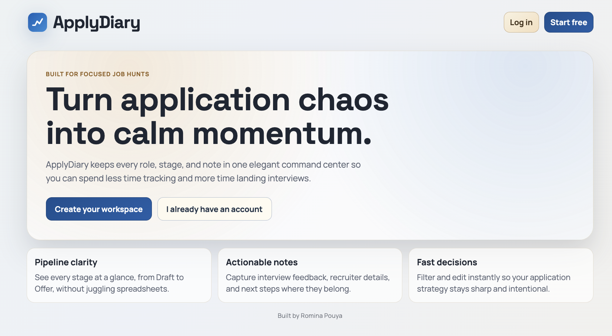
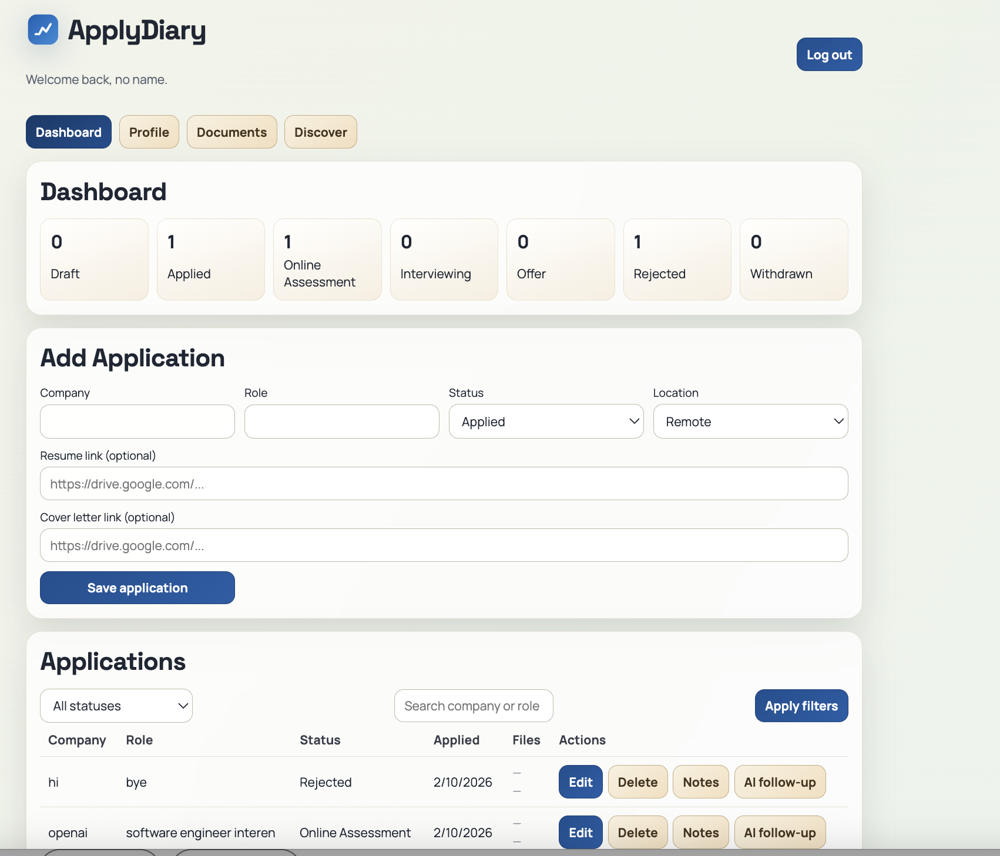
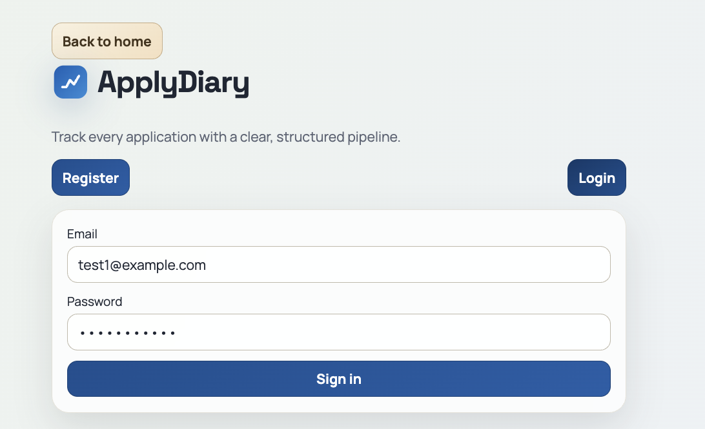
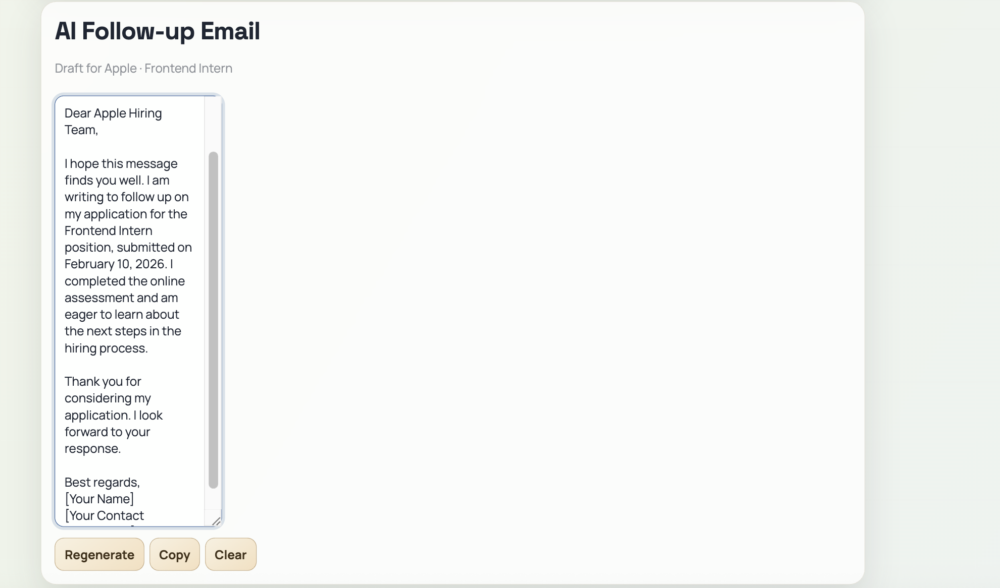

# ApplyDiary

ApplyDiary is a full-stack job application tracker with a React frontend and Express API.

## Portfolio Preview


Landing Page:

Dashboard:

Auth flow:


AI follow-up:


## Project Structure

- `apps/web`: React + Vite client
- `apps/api`: Express + TypeScript API

## Quick Start (One Command)

1. Install dependencies

```bash
npm install
```

2. Configure environment

```bash
cp apps/api/.env.example apps/api/.env
cp apps/web/.env.example apps/web/.env
```

3. Start everything (Postgres + API + Web)

```bash
npm run dev
```

This command:
- starts PostgreSQL via Docker Compose
- applies Prisma migrations
- runs API and web dev servers together

## Manual Start (Alternative)

```bash
npm run db:up
npm --workspace apps/api run prisma:deploy
npm run dev:api
npm run dev:web
```

To stop the database container:

```bash
npm run db:down
```

## Current Scope

This initial scaffold includes:
- JWT auth (`/auth/register`, `/auth/login`)
- Auth-protected application CRUD (`/applications`)
- Inline edit/delete actions in the applications table
- Per-application note CRUD (`/applications/:id/notes`)
- Profile editing (`/auth/me`)
- Document uploads (`/documents`)
- AI follow-up email drafts (`/ai/followup-email`)
- Status filtering, search, and sorting
- PostgreSQL persistence via Prisma ORM

## AI (Optional)

To enable AI follow-up drafts, set the environment variable:

```
OPENAI_API_KEY=your_key_here
```
